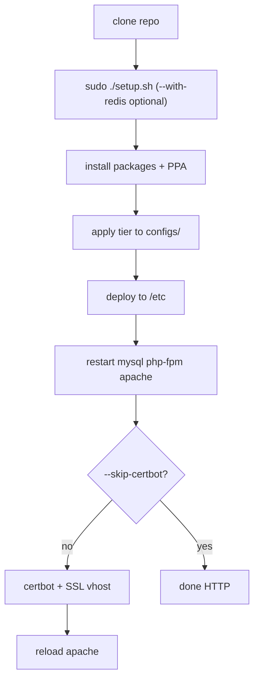

# Documentation flow

## Start here

| Step | File | Purpose |
|------|------|---------|
| 1 | [README.md](../README.md) | Overview, frameworks (WP/Laravel/CI), optional Redis |
| 2 | **`setup.sh`** | One-shot install on the server |
| 3 | [docs/SCALING.md](SCALING.md) | Tier capacity and manual tuning |
| 4 | [docs/SETUP.md](SETUP.md) | Manual steps / troubleshooting |

## Install flow (automated)



## Runtime path

```mermaid
flowchart LR
  Client[Browser] --> Apache[Apache event MPM]
  Apache -->|static| Disk[/var/www/html]
  Apache -->|*.php| FPM[PHP 8.3-FPM]
  FPM --> OPcache[OPcache]
  FPM --> WP[WordPress]
  WP --> MySQL[(MySQL 8)]
```

## Config map

| `configs/` file | System path | Layer |
|-----------------|-------------|--------|
| `apache-mpm.conf` | `/etc/apache2/mods-available/mpm_event.conf` | Apache workers |
| `apache-vhost-http.conf` | `/etc/apache2/sites-available/000-default.conf` | HTTP site |
| `apache-vhost-ssl.conf` | `*-le-ssl.conf` after Certbot | HTTPS + hardening |
| `mysqld.cnf` | `/etc/mysql/mysql.conf.d/mysqld.cnf` | Database |
| `php.ini` | `/etc/php/8.3/fpm/php.ini` | PHP limits |
| `opcache.ini` | `/etc/php/8.3/fpm/conf.d/10-opcache-custom.ini` | Bytecode cache |
| `php-fpm-www.conf` | `/etc/php/8.3/fpm/pool.d/www.conf` | Concurrency cap |

## Dependencies

1. `pm.max_children` × `memory_limit` must fit RAM with MySQL buffer pool and OPcache.  
2. `setup.sh --tier` patches all four layers together.  
3. Apache `SetHandler` must use `/run/php/php8.3-fpm.sock`.  
4. `opcache.validate_timestamps=0` (tiers 64/32/16) → reload FPM after every deploy.

## Removed / consolidated

| Removed | Reason |
|---------|--------|
| `commands.txt` | Replaced by `setup.sh` |
| `apache2.conf` | Duplicate of SSL vhost; use `configs/apache-vhost-ssl.conf` |
| Root-level `64gb*.conf` | Moved to `configs/` with stable names |

## After go-live

| Event | Command |
|-------|---------|
| Code deploy | `sudo systemctl reload php8.3-fpm` |
| SSL renewal | `certbot.timer` (enabled by setup) |
| OOM / swap | Re-run with lower `--tier` or edit `configs/php-fpm-www.conf` |
